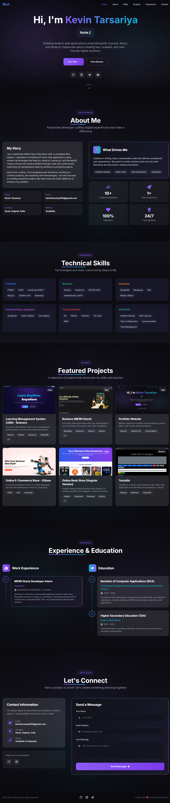

# 💼 Kevin Tarsariya - Developer Portfolio

🚀 Welcome to my personal portfolio website built using modern web technologies.  
This portfolio showcases my projects, skills, and experience About
A fully responsive portfolio built using React, Tailwind CSS, and Framer Motion featuring animations, project filtering, and resume download.

### Preview



---

🔗 [Live Demo](https://mr-k-portfolio.vercel.app)

---

## 📌 About Me

Hi, I'm **Kevin Tarsariya**, a passionate **MERN Stack Developer** and BCA student from Surat, India.  
I specialize in building full-stack web applications using modern technologies like **MongoDB, Express.js, React.js, and Node.js**.

💡 I enjoy solving real-world problems through code and creating clean, user-friendly interfaces.

---


## 🚀 Features

- 🌙 Dark Theme UI
- ⚡ Fast & Responsive Design
- 🎯 Smooth Scrolling
- ✨ Animations using Framer Motion
- 🔍 Project Filtering System
- 📄 Resume Download Option
- 📱 Mobile Friendly

---

## 🛠️ Tech Stack

### 💻 Frontend
- **React.js** – For building interactive UI components  
- **Tailwind CSS** – For fast, responsive, and modern styling  
- **Framer Motion** – For smooth animations and transitions  
- **JavaScript (ES6+)** – Core scripting language  
- **HTML5 & CSS3** – Markup and styling foundation  

## 📁 Folder Structure


src/
│── components/
│── pages/
│── assets/
│── data/
│── App.js
│── main.jsx


---

## ⚙️ Installation & Setup

Follow these steps to run the project locally:

```bash
# Clone the repository
git clone https://github.com/Kevin-Tarsariya/MR.K-Portfolio

# Navigate to project folder
cd your-repo-name

# Install dependencies
npm install

# Start development server
npm run dev

📬 Contact Me
📧 Email: kevintarsariya913@gmail.com 
💼 LinkedIn: [(https://www.linkedin.com/in/kevin-tarsariya/](https://www.linkedin.com/in/kevin-tarsariya/)
🐙 GitHub: https://github.com/Kevin-Tarsariya
⭐ Support

If you like this project, give it a ⭐ on GitHub!

📜 License

This project is open-source and available under the MIT License.

🙌 Acknowledgements
React.js Documentation
Tailwind CSS
Open Source Community
🔥 Built with passion by Kevin Tarsariya
